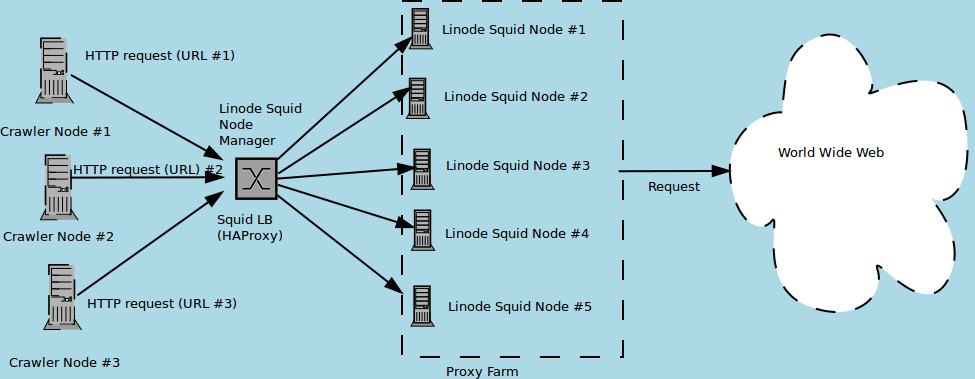
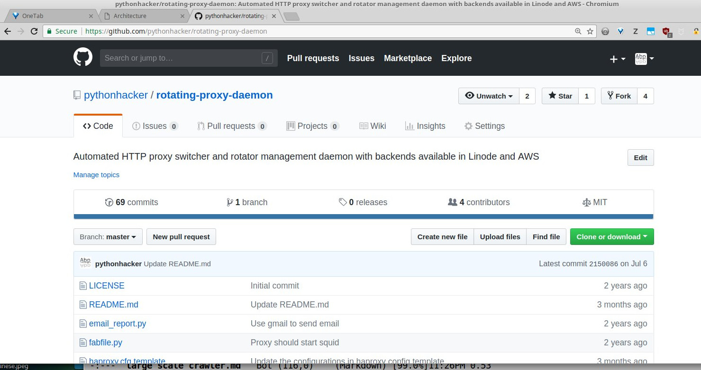

# Large Scale Web Crawling in Python

__Anand B Pillai__, <anandpillai@letterboxes.org>, @skeptichacker  
__Noufal Ibrahim__, <noufal@nibrahim.net.in>, @noufalibrahim  

---
# Speakers

<table>
<tr><td></td><td></td></tr>
<tr><td>&nbsp;&nbsp;&nbsp;&nbsp;&nbsp;&nbsp;&nbsp;Anand B Pillai</td>
<td>&nbsp;&nbsp;&nbsp;&nbsp;&nbsp;&nbsp;&nbsp;&nbsp;&nbsp;&nbsp;&nbsp;&nbsp;Noufal Ibrahim</td></tr>
<tr><td>&nbsp;&nbsp;&nbsp;&nbsp;&nbsp;&nbsp;&nbsp;&nbsp;&nbsp;&nbsp;&nbsp;&nbsp;&nbsp;&nbsp;&nbsp;&nbsp;&nbsp;&nbsp;&nbsp;PSF Fellow, Author, Software Architect.</td>
<td>&nbsp;&nbsp;&nbsp;&nbsp;&nbsp;&nbsp;&nbsp;&nbsp;&nbsp;&nbsp;&nbsp;&nbsp;&nbsp;&nbsp;&nbsp;&nbsp;&nbsp;&nbsp;&nbsp;&nbsp;&nbsp;&nbsp;&nbsp;&nbsp;&nbsp;PSF Fellow, Founder & CEO, Hamon Technologies.</td></tr>
</table>

---
## This talk is composed of two stories.

* Story of an Engineer solving an *itch* and publishing the source code.
* Story of how this was used by one of his friends to solve a problem.

---

## Web Crawling

* Automated browsing and data extraction from websites
* Performed by dedicated programs called `spiders` or `crawlers`
* Usually uses specific `rules` to fetch specific data or perform certain actions.

---

## Some Use-cases

* Search Engines
* Automatic Website Maintenance (Link Checking)
* Blog Aggregation
* Academic Research

---

## Large scale crawling

* **Intent**   - Crawl multiple websites at a given time (50 ~ 100)
* **Goal**     - Save thousands of URLs per site, totalling millions of URLs across websites.
* **Timespan** - Days and Weeks ( < 1 month )

---

## Problems (a few!)

1. Crawl Aggressiveness - How polite or aggressive your crawl is.
1. Crawling Errors      - Catching and dealing with errors in fetching URLs
1. URL De-Duplication   - Making sure you don't keep crawling URLs again and again.
1. URL Traps            - Making sure your crawler doesn't get lost in part of a website.

We are going to focus on (1) for most of this talk.

---

# First Story

---

## Startup Troubles

* In 2015, I was building a large-scale ecommerce search engine for my employer.
* Involved crawling multiple e-commerce websites and harvesting product data and indexing them to SOLR.
* A typical crawl involved collecting 100s of 1000s of URLs from one website.
* The SOLR index size (at peak) was 30 million (3 Cr) products.

---

## Crawl - Aggressive or Polite ?

* Too polite - You take too much time in downloading and indexing the data.
* Too aggressive - The sites block your crawlers I.P address by using Firewall rules!
* In between     - You always risk getting blocked anyway if you crawl long enough from same IP.

---

## Solution - Rotating Proxies

* Rotating Proxies provide you with a set of IP addresses behind which you `hide` your crawlers IP.
* Your crawl is sent through multiple IP addresses.
    * Firewall rules find it difficult to engage when source IP addresses switch a lot.
    * In worst case the proxy IP is blocked but you can always get a fresh set of proxies.
* Examples - NoHoDo, ProxyRotator, etc.

---

## Problems

* Most of these services limit your concurrent connections (usually 100-200 connections max)
* You don't have control over the actual proxy servers.
* You share the proxy nodes with others - not great for security.
* Your costs escalate pretty soon if your crawls are huge and continuous.

---

## Solution - Build Own Proxy

* Build a proxy rotator with `Linode` as the ISP
* A Python middleware program takes care of active proxy rotation.
* Proxies use `squid` to fetch pages. Caching on proxies can be turned on or off.

---

## Why Linode ?

* Has a nice and simple API which can be easily automated via Python.
* A Python wrapper on the API was already available which was forked & enhanced.
* Has data centers in Europe, Asia apart from multiple ones in US.
* Very reasonable VPS costs.

---

## Solution - Build Own Proxy (contd.)

* Clients (crawlers) connect to a node which deploys `HAProxy`
* The `HAProxy` node is the `gateway` which load-balances the requests to the squid nodes.
* The python middleware (rotating-proxy-daemon) runs in the gateway node.
* For preventing anyone from using the system (open proxy!), the squid nodes use HTTP (basic) authentication.

---

## Architecture

---

## Code

---

## Story Conclusion

* I was able to do faster and more reliable crawls under a fraction of the earlier costs.
* Re-used the same architecture and system successfully in the next two startups I worked for.

---

## Typical Deployment and Costs

* Gateway Node - 2GB Linode (10 $pm)
* Using a Linode 1GB Node (5$ pm) and with a proxy-farm of 15-20 nodes: 80-90 $ pm
* Using a Linode Nanode (2$ pm) and with a proxy-farm of 15-20 nodes: 40-50 $ pm
* Unlimited connections, nearly unlimited bandwidth, total control of your infrastructure.

---

# Second Story

---

## The Data Problem

* The ML problem is a data problem
* The data problem is two fold
    * Getting data
    * Cleaning data
* We needed a few ten million URLs 
* From six "data sources" via. "undocumented APIs"

---

## The Blocking Problem

* The sources were blocking the crawlers from the same IP after a few dozen hits.
* The initial solution was to use `tor`. 
* About 4s per URL. Tooooo slow...!

---

## Used the Rotating Proxy

* Added AWS support (and contributed code back to the project)
* Used a cluster of 10 proxies and the load balancer.

---

## A Digression

* Machines got compromised twice.
* Used about 1 month of bandwidth in half a day :-P

--- 

## Performance Improvement

* Once set up, we got between 0.9 and 1.5s per URL.
* Some issues still persisted. 
    * Changing User-agents
    * Frequency of Rotation

---

## Some thoughts and future plans

* Abstract out cloud provider.
* Create ansible notebooks for machine setups.
* Modernise the infrastructure some more.
* Perhaps make the whole thing available as a service? :)

---

## References

1. [Rotating Proxy Daemon](https://github.com/pythonhacker/rotating-proxy-daemon)
1. [Linode Python API](https://bitbucket.org/skeptichacker/linode/)
1. [Squid Caching Proxy](http://squid-cache.org/)
1. [HAProxy](http://www.haproxy.org)
1. [MultiCrawler](https://github.com/pythonhacker/multicrawler)
1. [Scrapy Rotating Proxies](https://github.com/TeamHG-Memex/scrapy-rotating-proxies)

---

Thank You.

