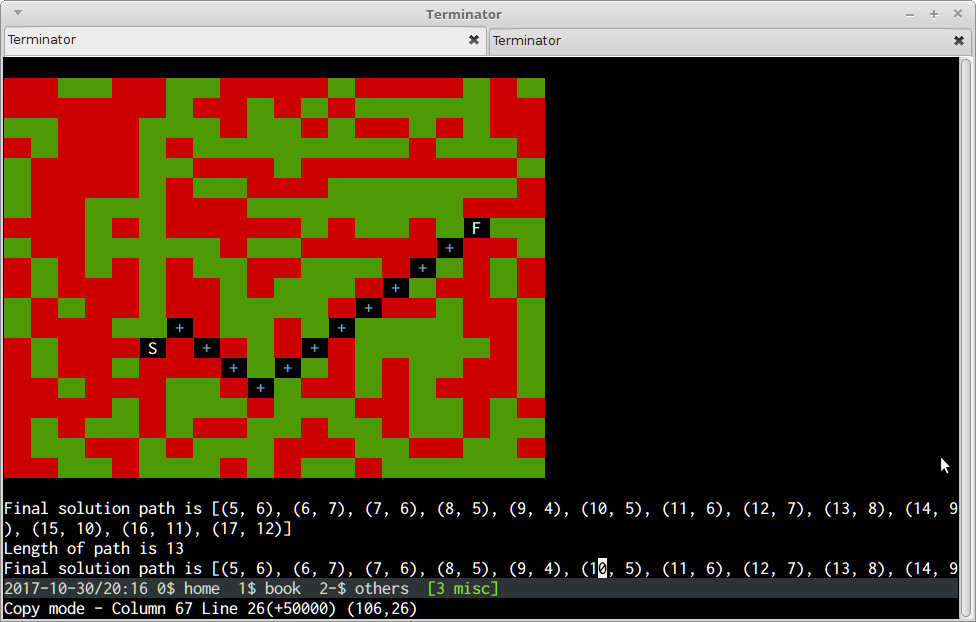

## Concurency workshop in PyCon India 2017, New Delhi, Nov 2 2017

This is a workshop on concurrency in Python 3.0. We will talk about the Python **multiprocessing** module and **concurrent futures** and look at around 3-4 interesting examples of getting the best out of Python by writing concurrent code using these techniques for solving data parallel problems.

The examples we will be looking at here would be,

1. **Matrix Multiplication** - Parallelize matrix multiplication using multiprocessing.
2. **Primes** - Demoing the effect of GIL in multi-threaded programs.
3. **Fractal** - Demonstrating how to parallelize creation of a Mandelbrot fractal in Python using multiprocessing and/or concurrent futures.
4. **Crawler** - Writing a web-crawler which performs concurrent fetches using concurrent futures and/or multiprocessing .
5. **Maze Solver** - A maze generator and solver in Python running on the text console - Demonstrating serial and concurrent solvers using multiprocessing.
6. **Hash Detect** - Detect a filename matching a given hash - serial and parallel version.
